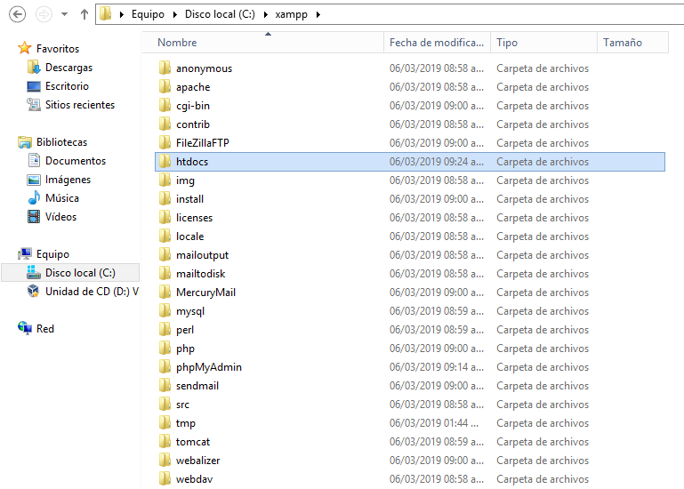
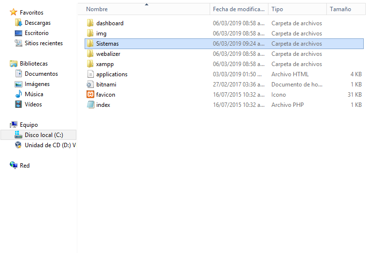
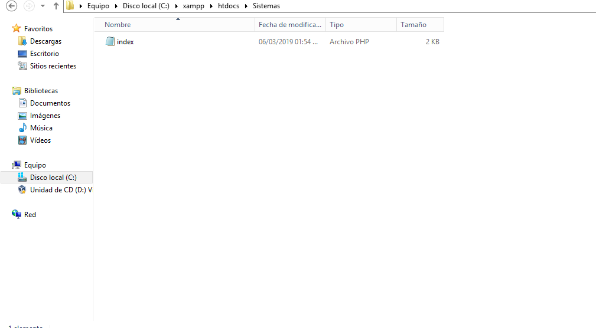
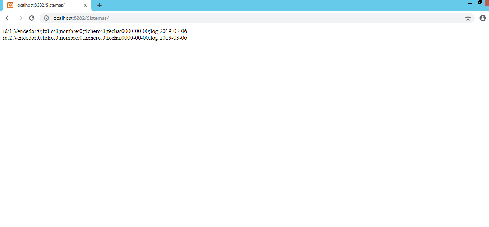
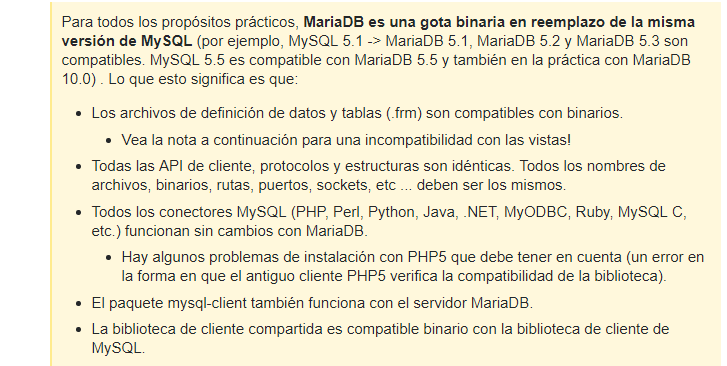

# Config-Xampp-con-puertos-diferentes

### Pasos que se deben de seguir para configurar XAMPP con puertos distintos a los establecidos y con contraseña root diferente a la establecida. Ayuda también cuando los puertos esta ocupados.

#### _Requisitos:_
* Tener instalado XAMPP

#### _Pasos:_
1.- Iniciar XAMPP


***

2.- Damos click en el botón _Config_ del **Apache**. Abrimos el archivo "Apache (httpd.conf)"

***

3.-	Buscamos las lineas **ServerName localhost:_puerto_** y **Listen:_puerto_** en el archivo. En **_puerto_** ponemos el que nosotros queremos.(En este caso es 8282)


***

4.- Toca mysql, damos click en el botón _Config_ de **Mysql**. Abrimos el archivo "my.ini"

***

5.- Buscamos las lineas **Port  = _puerto_** que aparece en dos líneas del archivo. En **_puerto_** ponemos el que nosotros queremos. (En este caso es 8383).

***

6.- Buscamos el archivo **Config.inc.php** que se encuentra en la dirección _C:\xampp\phpMyAdmin_ y cambiamos la linea **127.0.0.1** a **127.0.0.1:8383**. En mi caso es 8383 el puerto, se debe de poner el puerto con el cual haya configurado mysql.


***
7.- Iniciamos **Apache** y **Mysql** y aparecerán en verde.


***
8.- En un navegador ponemos **localhost:8282**, aparecerá lo siguiente. El 8282 es el caso que se configuró aquí pero se deberá poner el puerto que configuraron en el paso 3.


***
9.-Tambien podremos abrir phpmyadmin, damos click en el y aparecerá lo siguiente.


***
10.- Volvemos al panel de Xampp y damos click en **Shell**.

Se verá lo siguiente.


***
11.- Ingresamos **mysql -u root -p** (ENTER), nos pedirá contraseña, le damos enter nadamas y se verá lo siguiente.


***
12.- Estando ahí ingresamos lo siguiuente.
**mysql> use mysql;
mysql> update user set password=PASSWORD(“root”) where User=’root’;
mysql> flush privileges;
mysql> quit.**

Donde password=PASSWORD(“root”) en la parte root es la nueva contraseña.

Volvemos abrir el archivo que mencionamos en el punto 6 y en donde dice password ponemos la nueva contraseña que asignamos al root.

***
13.- Nos salimons con **exit;** y volvemos a introducir **mysql -u root -p** con la nueva contraseña cuando se pida.


***
14.- Creamos una base de datos **CREATE database folios;** y la usamos **use folios;**


***
15.- Creamos una tabla **CREATE table factura2;**


***
16.- Verificamos en phpmyadmin que se ha creado la base de datos y la tabla.


***
17.- Ahora creamos en **htdocs** una carpeta y dentro de esa carpeta creamos un archivo **index.php**. En este caso la carpeta se llama **Sistemas**.




***
18.- En el archivo **index.php** ponemos el siguiente codigo. Donde dice servername ponemos el nombre del servidor junto con el puerto que configuramos para apache.
En username ponemos el usuario con el cual que nos queremos conectar.
En password ponemos la contraseña del usuario.
dbname ponemos el nombre de la base de datos.
```php
<?php
$servername='localhost:8383';
$username='root';
$password='rootarg';
$dbname='folios';

//Create connection
$conn = new mysqli($servername,$username,$password,$dbname);
//Check connection
if ($conn->connect_error)
{
	Die("Connection failed: ".$conn->connect_error);
}

$id = isset($_GET['id'])?$_GET['id']:0;
$vendedor = isset($_GET["id"])?$_GET['id']:'0';
$folio = isset($_GET["folio"])?$_GET['folio']:'0';
$nombre = isset($_GET["nombre"])?$_GET['nombre']:'0';
$fichero = isset($_GET["fichero"])?$_GET['fichero']:'0';
$fecha = isset($_GET["fecha"])?$_GET['fecha']:'0';

$sql = "SELECT * from factura2 where vendedor = '".$vendedor."'";
$sql ="insert into factura2 (vendedor, folio, nombre, fichero, fecha, log) values ($vendedor,$folio,'$nombre','$fichero','$fecha', now())";
//echo $sql;
$result = $conn->query($sql);

$sql = "SELECT * from factura2 where vendedor = '".$id."'";
//echo $sql;
$result = $conn->query($sql);
If ($result->num_rows > 0){
//output data of each row
While($row = $result->fetch_assoc())
{
	echo "id:".$row["id"].";Vendedor:".$row["vendedor"].";folio:".$row["folio"].";nombre:".$row["nombre"].";fichero:".$row["fichero"].";fecha:".$row["fecha"].";log:".$row["log"]."<br>";
	}
}
$conn->close();
//http://Servidorerla:8282/factura/data4.php?id=1&folio=456&nombre=alma&fichero=reads.pdf&fecha=2019/01/30
?>
```

***
19.- Y por ultimo vamos a un navegador y ponemos la siguiente línea
En _puerto_ ponemos el que configuramos para apache y en _Carpeta_creada_ ponemos la que cremos en el punto 17.
**localhost:puerto/Carpeta_creada**
Esto mostrará lo siguiente y hemos terminado por fin.



Nota: Puede que haya un problema al apagar mysql y volver a conectarlo ya que los datos que estaban se borrarán.



***
#Archivos compatibles que puede abrir Ilustrator
Son para que el archivo pueda ser editado en otra forma, no en su estado final.

|Formato|Extensión| |
|---|---|---|
| Archivo Adobe Idea  | .idea|Vectores de imagen
| Adobe Ilustrator  | .ai y .ait  |
| Adobe Ilustrator Draw  | draw  |
|Adobe Ilustrator Line| line|
|Adobe PDF|pdf|
|Adobe Potoshop Sketch|sket|
|Dibujo de autoCAD|dwg|
|Archivo de intercambio de AutoCAD|dxf|
|BMP|bmp,rle,dib|
|Meta de archivo de gráficos para PC|cgm|
|CorelDraw|cdr|
|PostScript encapsulado|eps,epsf,ps|Mantiene muchos de los elementos gráficos que puede construir con Ilustrator. Vectoriales como mapa de bits |
|Metarchivo mejorado|emf|
|GIF89a|gif|
|EPS de Ilustrator|eps,epsf,ps|
|JPEG|jpg,jpe,jpeg|
|JPEG2000|jpf,jpx, jp2, j2k, j2c,jpc|
|Macintosh PICT|pic,pct|
|Microsoft RTF|rtf|
|Microsoft Word|doc|
|Microsoft Word Docx|docx|
|PCX|pcx|
|Photoshop|psd pdd|
|Pixar|pxr|
|PNG|png,pns|
|SVG|svg|Formato vectorial que produce gráficos interactivos de gran calidad par internet|
|SVG Comprimido|svgz|
|Targa|tga,vda,icb,vst|
|Texto|txt|
|TIFF|tif,tiff|
|Metarchivo de Windows|wmf|

##Archivos que puede colocar Ilustrator
Sirve para traer elementos en una hoja donde ya se empezó hacer algunos dibujos.

|Formato|Extensión|
|---|---|---|
|Adobe Illustrator| (ai, ait)|
|Adobe PDF| (pdf)|
|AutoCAD Drawing| (dwg)|
|AutoCAD Interchange File| (dxf)|
|BMP |(bmp, rle, dib)|
|Metarchivo de gráficos para PC| (cgm)|
|CorelDRAW 5, 6, 7, 8, 9, 10|(cdr)|
|PostScript encapsulado|(eps, epsf, ps)|
|Metarchivo mejorado| (emf)|
|GIF89a| (gif)|
|JPEG| (jpg, jpe, jpeg)|
|JPEG2000| (jpf, jpx, jp2, j2k, j2c, jpc)|
|Macintosh PICT| (pic, pct)|
|Microsoft RTF| (rtf)|
|Microsoft Word| (doc)|
|Microsoft Word|DOCX (docx)|
|PCX| (pcx)|
|Photoshop| (psd, pdd)|
|Pixar| (pxr)|
|PNG| (png, pns)|
|SVG |(svg)|
|SVG comprimido |(svgz)|
|Targa |(tga, vda, icb, vst)|
|Texto |(txt)|
|TIFF |(tif, tiff)|
|Metarchivo de Windows |(wmf)|


##Archivos para guardar
Abre archivos para que sean editados en ilustrator o en otra aplicación

|Formato|Extensión|
|---|---|---|
|Adobe Illustrator| (ai)|
|Adobe PDF| (pdf)|
|Illustrator EPS| (eps)|
|Illustrator Template| (ait)|
|SVG| (svg)|
|SVG comprimido| (svgz)|


##Formato para exportar (No nativos)
Es para declarar el archivo como final, ya para que sea utilizado.	
Ilustrator no puede recuperar todos los datos si vuelve abrir el archivo en ilustrator. Se recomienda que acabe de editar el archivo y hasta el final exportarlo.

|Formato|Extensión|
|---|---|---|
|AutoCAD Drawing |(dwg)
|AutoCAD Interchange File| (dxf)
|BMP| (bmp)
|CSS| (css)
|Metarchivo mejorado| (emf)
|Flash| (swf)
|JPEG| (jpg)
|Macintosh PICT| (pct)
|Photoshop| (psd)
|PNG| (png)
|SVG| (svg)
|Targa| (tga)
|Formato de texto| (txt)
|TIFF| (tif)
|Metarchivo de Windows| (wmf)|

##Para guardar en la web
|Formato|Extensión|
|---|---|---|
|GIF|gif
|JPEG|jpg|
|PNG|png|


|Formato|Extensión|
|---|---|---|
|Mapa de bits| Gráfico Vectorial|
|Utilizan una cuadricula rectangular que esta formada por pixeles. Cada pixel se le asigna una ubicación y un valor de color.|Se describen mediante lineas, formas y otros componentes gráficos de imagen almacenados en un formato que incorpora fórmulas geométricas.|
|Se editan los pixeles.| Se editan los vectores. Objetos definidos por vectores pueden ser modificados en el futuro|
|Dependen de la resolución, número total de pixeles. Pierden detalle si se cambia la escala.| Las imágenes siguen iguales aunque se redimensionen.|
|Imágenes de tono continuo (degradados sutiles de sombras y color). Fotografias y videos.|Usos web y diseños impresos.|
|Gran espacio de almacenamiento.| Menos espacio de almacenamiento.|
|jpg, png, bmp, gif| SVG, EPS, PDF, crd, ink|


##Compatibles con Ilustrator 
**En estas podemos reutilizar los gráficos vectoriales**
- _Potoshop_
- _InDesign_
- _XD_
- _Premiere Pro_
