# Config-Xampp-con-puertos-diferentes

### Pasos que se deben de seguir para configurar XAMPP con puertos distintos a los establecidos y con contraseña root diferente a la establecida. Ayuda también cuando los puertos esta ocupados.

#### _Requisitos:_
* Tener instalado XAMPP

#### _Pasos:_
1.- Iniciar XAMPP
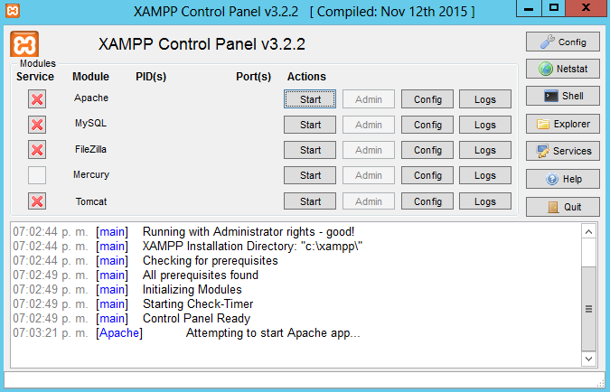
***

2.- Damos click en el botón _Config_ del **Apache**. Abrimos el archivo "Apache (httpd.conf)"
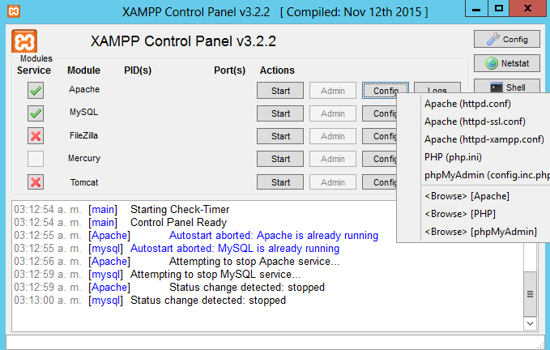
***

3.-	Buscamos las lineas **ServerName localhost:_puerto_** y **Listen:_puerto_** en el archivo. En **_puerto_** ponemos el que nosotros queremos.(En este caso es 8282)
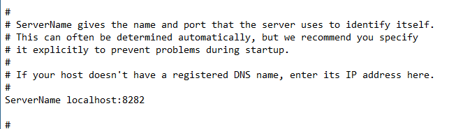

***

4.- Toca mysql, damos click en el botón _Config_ de **Mysql**. Abrimos el archivo "my.ini"
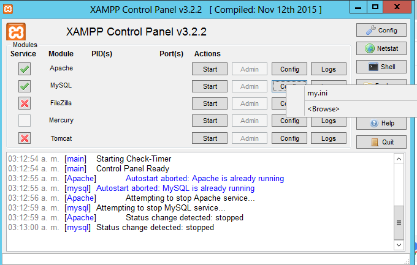
***

5.- Buscamos las lineas **Port  = _puerto_** que aparece en dos líneas del archivo. En **_puerto_** ponemos el que nosotros queremos. (En este caso es 8383).

***

6.- Buscamos el archivo **Config.inc.php** que se encuentra en la dirección _C:\xampp\phpMyAdmin_ y cambiamos la linea **127.0.0.1** a **127.0.0.1:8383**. En mi caso es 8383 el puerto, se debe de poner el puerto con el cual haya configurado mysql.

***
7.- Iniciamos **Apache** y **Mysql** y aparecerán en verde.

***
8.- En un navegador ponemos **localhost:8282**, aparecerá lo siguiente. El 8282 es el caso que se configuró aquí pero se deberá poner el puerto que configuraron en el paso 3.
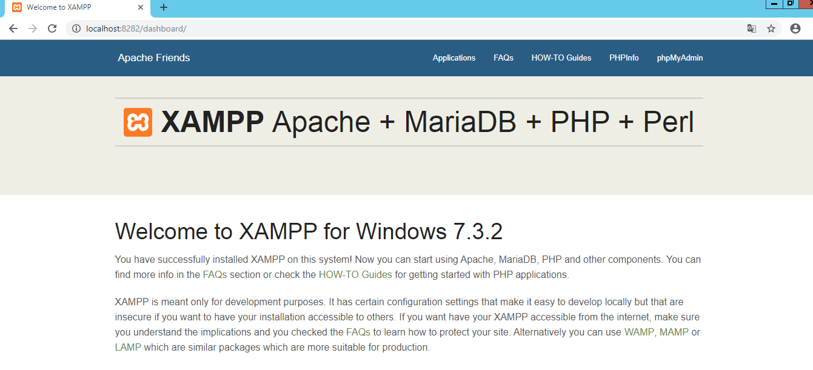

***
9.-Tambien podremos abrir phpmyadmin, damos click en el y aparecerá lo siguiente.
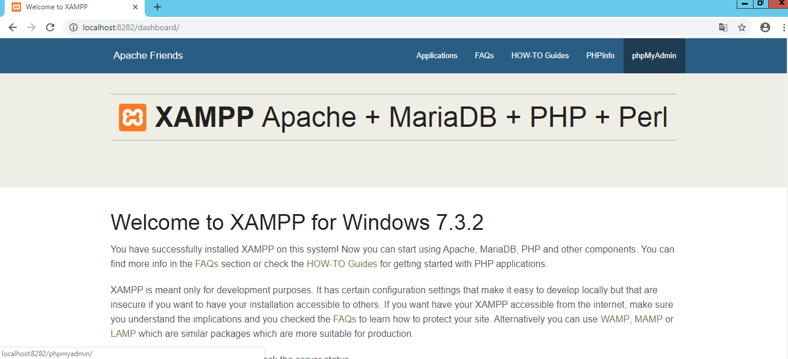
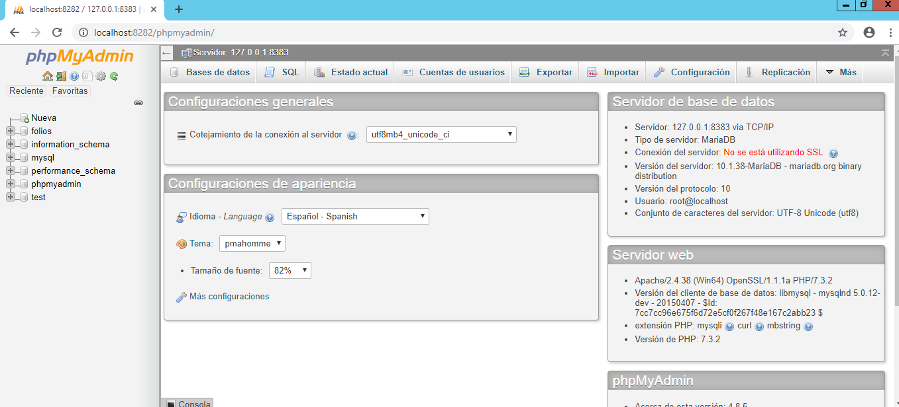

***
10.- Volvemos al panel de Xampp y damos click en **Shell**.
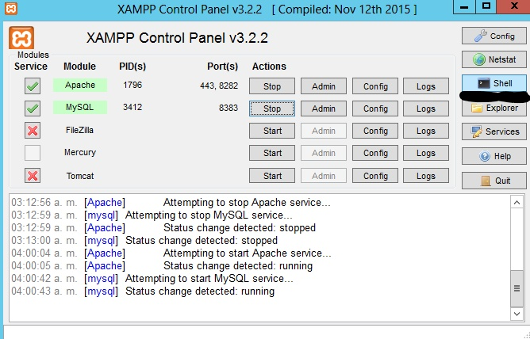
Se verá lo siguiente.

***
11.- Ingresamos **mysql -u root -p** (ENTER), nos pedirá contraseña, le damos enter nadamas y se verá lo siguiente.
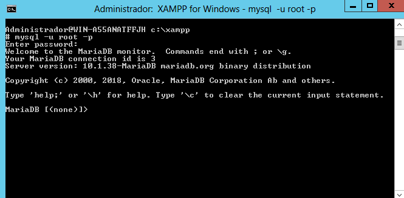

***
12.- Estando ahí ingresamos lo siguiuente.
**mysql> use mysql;
mysql> update user set password=PASSWORD(“root”) where User=’root’;
mysql> flush privileges;
mysql> quit.**

Donde password=PASSWORD(“root”) en la parte root es la nueva contraseña.

Volvemos abrir el archivo que mencionamos en el punto 6 y en donde dice password ponemos la nueva contraseña que asignamos al root.

***
13.- Nos salimons con **exit;** y volvemos a introducir **mysql -u root -p** con la nueva contraseña cuando se pida.
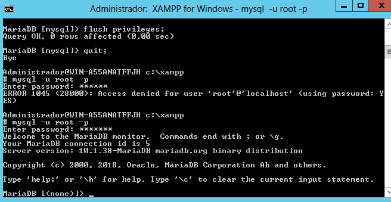

***
14.- Creamos una base de datos **CREATE database folios;** y la usamos **use folios;**
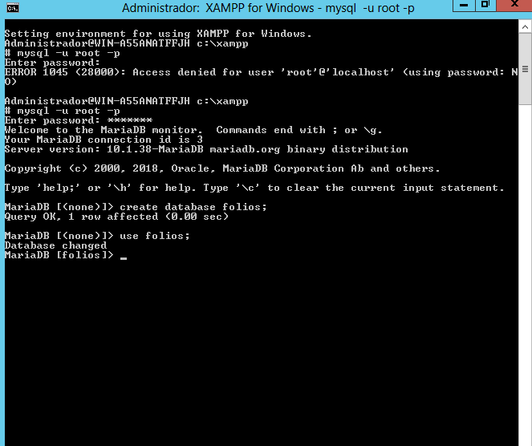

***
15.- Creamos una tabla **CREATE table factura2;**

***
16.- Verificamos en phpmyadmin que se ha creado la base de datos y la tabla.
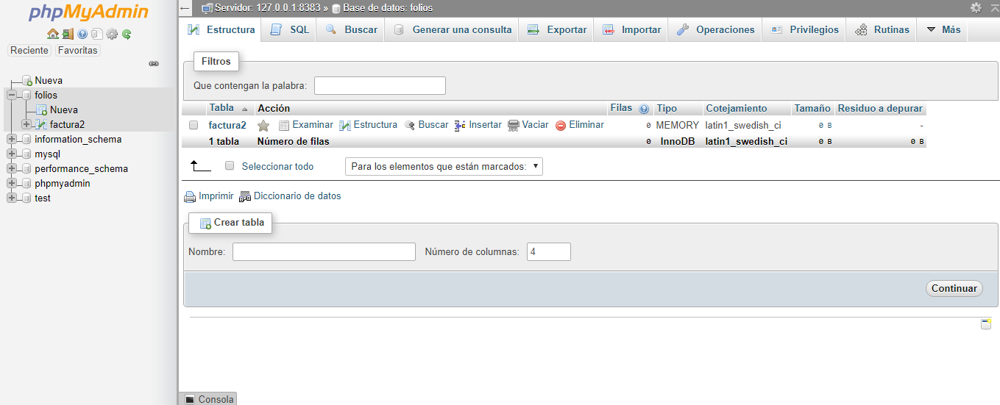

***
17.-